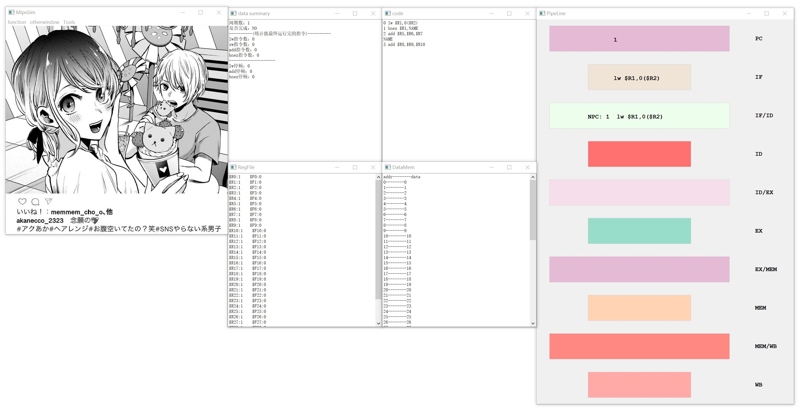

# pythonMipsSim
 
------------------------------
## 使用方法介绍

1. 界面组成
  刚开始打开界面由以下模块构成：
  

  * `主模块`：最左边的框图，为主`kernel`的所在地，有三个菜单栏，内容分别是：
    * `function`:
      * `open file`:打开文件目录查找相关文件，载入相关文件同时会重置上一次模拟的信息重新开始模拟
      * `run one cycle`:单步执行一个周期，执行结束后所有窗口的信息会更新
      * `run to end`:运行到程序结束，执行结束后所有窗口的信息会更新
      * `run to point`:运行到相关地址（0, 1, 2...）的相关阶段（IF, ID...），执行结束后所有窗口会更新信息

    * `otherWindow`:打开其他窗口
    * `tools`：选择使用重定向与否
      
      > CATION:请在执行程序前决定是否使用，在程序执行过程中再设置重定向会导致代码执行可能会出现错误
      
  * `data summary`:显示上述三操作结束后的kernel相关信息（具体信息见下图）


  * `code`:显示当前要执行的程序的各条语句的地址及语句本身
  * `regfile`:显示寄存器组的值（R0~R31, F0~F31）
      
    > CATION:此时设置的R寄存器的值全部都是1，F寄存器的值全部都是0，目的是方便观察相关的代码执行情况，如有需要可以更改相关代码的值
      
  * `dataMem`:显示数据存储器中的地址和相关数据信息

    > CATION:此时设置的每个数据存储器中的数据与自己的地址值相同，同样为了方便观察相关代码的执行情况

  * `pipeline`: 显示上面三操作结束后相关流水寄存器的值和语句执行到的段

2. 使用入门
  接下来我们用一个实际的实例来演示代码的运行周期流程
    0. 准备工作：
      确保你的电脑上有`python3`版本以上同时安装有`PyQt5`库
      打开命令行，`cd`到当前文件夹下，运行`run.py`
      ```cmd
        > python run.py
      ```
      即可看到图形化界面

    1. 打开代码
      点击`function`中的`open file`，选中你想要选择的文件，打开后各个窗口会显示初始化kernel的相关数据
      
      
    
    2. 首先使用run one cycle执行一个周期，执行完毕后各个窗口会显示相关的数据，如下图：
      
      
    
    3. 我们此时输入端点，输入的断点如图所示，为让地址为`1`的指令(`BNEZ $R1, NAME`)执行完`ex`段：

      

      执行结束后的信息如图：

      

    4. 最后我们让程序运行结束，点击`run to end`即会显示最终运行结束后各个寄存器，存储器，运行相关信息：

      

    5. 由于此时开启`forwarding`和不开相同，图片就不展示，实验者可以自行尝试其他代码


> 代码仍在测试阶段，如有实验中出现问题请发送相关信息和截图到yewang863@gmail.com, 我很开心你能与我一同解决这一问题

